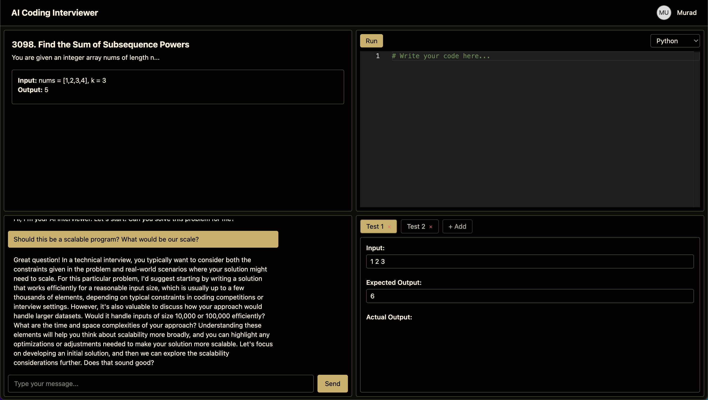

# 🧠 AI Coding Interviewer

A web platform that simulates **real-life coding interviews** with an AI interviewer.  
Users can solve coding challenges in a realistic coding environment, chat with an AI interviewer for hints/feedback, run code against test cases, and track progress over time.

---

## 🚀 Features

- **AI Interview Mode**  
  👨‍💻 Chat with an AI interviewer who adapts to your answers, references the full problem brief (constraints, hints, follow-ups), and reasons over your latest test results.

- **Resizable LeetCode-style Workspace**  
  🧩 Problem + chat stack on the left, full-height editor on the right, and a bottom drawer for test output. Vertical and horizontal splitters let you resize everything just like modern coding platforms.

- **Dual Themes**  
  🌗 Instantly switch between light and dark palettes (with proper markdown/code styling) via the navbar toggle.

- **Language-Aware Starter Templates**  
  📄 Every problem ships with function signatures, docstrings, and IO scaffolding for Python & JavaScript so you can focus on the core algorithm.

- **In-Browser Code Editor**  
  ✍️ Powered by Monaco (VSCode engine) with syntax highlighting, autocomplete, and per-language persistence.

- **Custom + Server Tests**  
  🧪 Define your own tests, run them all at once via the backend runner, and view pass/fail history in an expandable results drawer. Validation state is stored per problem + language.

- **Interactive Chat Panel**  
  💬 Markdown-rendered conversation that stays in sync with your code, tests, and validation status, so the interviewer can offer relevant guidance.

- **Progress Dashboard**  
  📊 The home page summarizes solved vs. needs-work problems using your latest validation data, all cached locally per session.

- **Local Persistence**  
  💾 Code, test cases, chat transcripts, language choice, and validation status auto-save in `localStorage`, so nothing is lost on refresh.

---

## 📸 Screenshots (WIP)

Here’s how the coding interview environment looks right now:



---

## 🛠️ Tech Stack

- **Frontend**: React + TypeScript + TailwindCSS
- **Editor**: Monaco Editor (`@monaco-editor/react`)
- **Backend**: Node.js + Express  
  - Runs Python/JavaScript code in a sandboxed process
  - Connects to OpenAI API for AI interviewer responses
- **Database**: *(planned, not yet implemented)* PostgreSQL for persistence
- **Auth**: *(planned, not yet implemented)* GitHub login

---

## 📅 Roadmap

- [x] Multi-pane layout + resizable splitters
- [x] Language-aware starter templates + per-problem persistence
- [x] AI interviewer chat integration with validation context
- [x] Test drawer + backend runner
- [x] Light/Dark theme toggle
- [ ] Interview agent persona (guided phases, hints, scoring)
- [ ] Session history / “New Interview” flow
- [ ] Hidden/official test suites
- [ ] Deployment (Vercel + Railway/Fly.io)

---

## ⚡️ Getting Started

Clone the repo:

```bash
git clone https://github.com/yourusername/ai-coding-interviewer.git
cd ai-coding-interviewer
````

Install dependencies:

```bash
npm install
```

Start the frontend:

```bash
npm run dev
```

Start the backend:

```bash
cd backend
npm install
node index.js
```

---

## ✨ Inspiration

This project is a portfolio piece inspired by FAANG-style interviews,
built to practice **full-stack engineering**, **AI integration**, and **developer UX**.
